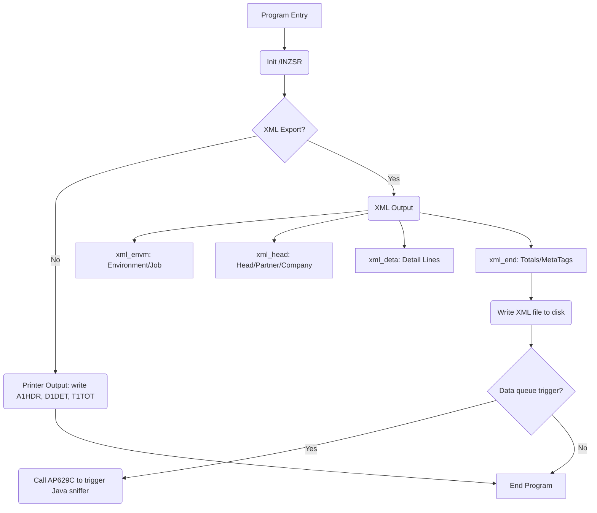

# RPG/ILE Program Explanation: Plukk-liste Print/Export (BO925R)

## Overview

This RPG/ILE program is responsible for printing and exporting "plukk-liste" (picklists) for warehouse/order picking operations. It has evolved to also support exporting report data as XML for integration with a JasperReports-based PDF solution, as well as archiving to disk and triggering processing via a data queue for Java integration.

### Key Features:
- Printing picklists to a printer or generating XML for JasperReports.
- Reads order, customer, item, and company/department data from various physical files.
- Supports department-level and company-level overrides for report headings.
- Handles both printed output and XML/PDF generation based on parameters.
- Subroutines to translate data to XML-safe text, and output to stream files.
- Extensive versioning and change log for maintenance.

---

## Main Structures

### 1. **File Declarations (`F-Specs`)**
- **Input Disk Files:**
  - `bohel1`, `bodtl1`: Order headers/lines.
  - `rkunl1`: Customer master.
  - `aforl1`, `afirl1`: Routine/company info.
  - `vvarl1`, `vvenl1`: Item and unit conversion data.
  - `fra07pf`, `ra09l1`, `fkprl1`: Department, sales, and customer-project registers.

- **Output:**
  - `BO925P`: Printer file for plukk-liste printing.

---

### 2. **Data Structures & Variables (`D-Specs`)**
- **LDA (Local Data Area) Offsets:** Used for job initialization, routing, and environment info (e.g., L_POFF, L_BACH, L_ARCH, etc.)
- **Work variables & flags:** For processing status, copying, XML file naming, temporary storage, etc.
- **Key fields:** For database lookups (e.g., `vvarl1_vare`, `fkprl1_kund`, etc.)
- **XML Output:** Variables and data structures for managing XML field output and filenames.

---

### 3. **Parameter Handling and Initialization**
- **Parameters:** The program expects entry parameters defining the order (`p_aarr`, `p_wsid`, `p_bong`, etc.)
- **Key lists:** For efficient lookup in various files via CHAIN/READE.
- **Field Initialization:** Work and parameter fields are set to blank or zero as appropriate at program startup.

---

## Program Flow

### 1. **Initialization (`*INZSR`)**
- Resets fields, sets up key lists, maps parameters, and performs initial file lookups.
- Determines if output is printed or exported to XML (Jasper), based on LDA values.
- Logs status and errors using AB705R if needed.

---

### 2. **Retrieve Data**

#### a. **Order Header**
- Looks up the order header and customer data.
- Fills in company/department data if specified.
- Fetches additional info like sales rep, payment terms, and delivery address.

#### b. **Department and Sales Info**
- If enabled, overrides heading with department names/info instead of company.
- Calls routines like `FØ707R` for company/dept. info and `FØ710R` for customer contact data.
- Fetches sales rep email/mobile as needed.

#### c. **XML Environment Setup (if exporting)**
- If XML/Jasper is enabled, setup environment variables, batch/job info, and report template paths.

---

### 3. **Print/Export Header**
- Depending on mode (print/XML), either writes to the printer file or calls a subroutine (`xml_head`) to format and output XML tags for headings.

---

### 4. **Detail Lines Processing**
- Loops through all order lines:
  - Fetches item info and computes additional values (e.g., conversion to warehouse units).
  - Optionally computes alternate quantities and units for warehouse logistics.
  - Output detail records to printer or call `xml_deta` subroutine for XML tag output.

---

### 5. **Totals and Finish**
- After all lines are processed, writes totals to printout or calls subroutines to finalize XML (e.g., `xml_endpackl`, `xml_end`).
- If archiving is active, generates special XML meta-tags and sends output to data queue if required.

---

## Subroutines

### **1. Data Translation for XML**
- Calls program `AP613R` to translate text fields into XML-safe text.
- Used for all fields that may contain special characters, such as names, addresses, etc.

### **2. XML Output Sections**
- Subroutines `xml_envm`, `xml_head`, `xml_deta`, `xml_endpackl`, `xml_end` manage various parts of the XML document:
  - **xml_envm:** Sets up environment variables for the job and output (print/archiving).
  - **xml_head:** Outputs company, department, partner, project, and other header info in XML format.
  - **xml_deta:** Outputs one order line as XML, with quantities, units, item text, etc.
  - **xml_endpackl:** Closes the detail section in XML.
  - **xml_end:** Finalizes the document, writes archive tags, and outputs the completed XML file.

### **3. Department Info Subroutine (`hnt_avde`)**
- Looks up department data and populates work variables for heading/addressing.
- Used for both output and XML export.

---

### **4. Payment Terms Subroutine (`SBBETB`)**
- Loads human-readable payment condition text for use in output and XML.

---

## Output Logic (Print vs. XML)

- **Printed Output** uses report formats (`A1HDR`, `D1DET`, `T1TOT`) and writes to an spooled printer file.
- **XML/Jasper Output** uses updatable variables and "write section" routines (e.g., `UpdHTMLVar`, `WrtSection`) which build an XML document for downstream processing/archiving/PDF generation.

---

## Error & Status Handling

- Logs key events and errors via program calls (`AB705R`), e.g., when print queue is invalid or XML template is missing.
- Updates job status and archives relevant info for later audit or troubleshooting.

---

## Change History

- The commented header provides a comprehensive history of modifications, showing the evolution from pure print to XML output, integration with Jasper, additional data fields, error handling improvements, and archiving logic.

---

## Key Takeaways For Onboarding

- **Maintainability:** Clear version management, subroutines for repeated logic, and modularization around business concepts (header, detail, totals, environments).
- **Integration:** Deep integration with external reporting (Jasper), XML generation, file system, and data queues.
- **Configurability:** Behavior toggled via LDA/job parameters to support multiple output scenarios.
- **Extensibility:** New fields, formats, and output types have been repeatedly added without major rewrites.
- **Legacy Constructs:** While much of the logic is in fixed-format RPG, newer elements (notably XML/Jasper) leverage /free and more modular designs.

---

## Practical Notes

- **Learning Curve:** The program mixes classic RPG coding with modern ILE and integration routines, so familiarity with both fixed-format and /free, as well as IBM i system programming, is useful.
- **Testing:** When making changes, pay attention to both printed and XML/Jasper outputs, as they have different code paths.
- **Debugging:** Many routines interact with job/environment data and rely on LDA; ensure correct setup for job context when troubleshooting.
- **Data Sources:** All master data is externalized (customers, items, warehouse, departments). Know where to find and how to query these files.
- **External Functions:** XML generation and output rely heavily on utility programs and prototypes (e.g., `UpdHTMLVar`, `WrtSection`).

---

# Diagram: High-Level Data Flow

---

# Summary

This is a highly configurable, business-critical RPG program for picklist processing. It supports both classic printing and modern, XML-based PDF reporting with archiving, department and customer overrides, and tight integration with external IBM i utilities and business logic. 

**Onboarding Tip:** Start by identifying which output modes your business currently uses (print vs. Jasper/XML/PDF), trace through the appropriate code path, and familiarize yourself with all the external programs and data files referenced.