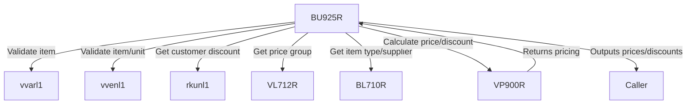

## Program Overview

This RPG program (BU925R) is part of the ASSHOP system, responsible for calculating and returning the price and discounts for a specified item/unit combination in a retail context. The program validates the existence of the item and item/unit combination, determines customer-specific discount categories, prepares a structured call to a pricing engine (VP900R), processes the returned pricing/discount data, and finally computes the net price after applying all discounts.

### Key Business Concepts

- **Items and Units:** Items (`vare`) can have multiple units (`enhe`). The program validates both exist in the item master files.
- **Customer Pricing:** Customers can have specific discount categories (`rabattkategori`) impacting pricing.
- **Discounts:** Up to two standard discounts and two "bruksrett" (usage right) discounts are supported.
- **Special Conditions:** Handles "skaffevare" (special order items) and customer club (`kundeklubb`) parameters.
- **Pricing Engine:** Delegates core price calculation logic to a central program (`VP900R`).
- **Error Handling:** Status codes are set for missing item or item/unit combinations.

---

## File Usage

- **rkunl1 (Customer File):** Used to look up the customer’s discount category.
- **vvarl1 (Item File):** Used to verify item existence.
- **vvenl1 (Item/Unit File):** Used to verify item/unit combination existence.

---

## Parameter Structure

### Input Parameters

- **p_firm:** Company code.
- **p_kund:** Customer number.
- **p_kpro:** Customer project.
- **p_vare:** Item number.
- **p_enhe:** Unit of measure.
- **p_lety:** Delivery type.
- **p_lagr:** Warehouse code.
- **p_dato:** Pricing date.
- **p_klub:** Customer club indicator (from v6.32).
- **p_skaf:** Special order indicator (from v8.01).

### Output Parameters

- **p_sapr:** Sales price.
- **p_rab1/p_rab2:** Discount 1 and 2.
- **p_brr1/p_brr2:** Usage right discounts 1 and 2.
- **p_kpri:** Price code.
- **p_kamp:** Campaign code.
- **p_netp:** Net price (calculated in this program).
- **p_kopr:** Cost price.
- **p_stat:** Error/status indicator (1: item missing, 2: item/unit missing).

---

## Main Logic Flow

### Initialization (`*inzsr` Subroutine)

1. **Parameter Assignment:** Maps input parameters to working variables.
2. **Status Reset:** Sets `p_stat` to 0 (no error).
3. **Price Group Retrieval:** Calls `VL712R` to get the price group (`w_prgr`) for the item/warehouse.
4. **Item Type/Primary Supplier:** Calls `BL710R` (previously `VL710R`) to get item type and primary supplier.
5. **Date Validation:** Ensures the input date is valid, sets to current date if not.

### Main Program

1. **Item Existence Validation:**
   - If not a special order (`p_skaf = 0`), checks if the item exists in `vvarl1`.
   - Sets `p_stat = 1` and exits if not found.
2. **Item/Unit Combination Validation:**
   - Checks if the combination exists in `vvenl1`.
   - Sets `p_stat = 2` and exits if not found.
3. **Customer Discount Category:**
   - Looks up the customer in `rkunl1` to get `rabattkategori` (`rkrabk`).
   - Defaults to 0 if not found.
4. **Prepare Call to Pricing Engine (VP900R):**
   - Populates the input data structure (`hirec`) with all relevant parameters, including special order flags and customer club.
   - Calls `VP900R` with `hirec` (input) and `horec` (output).
5. **Process Output:**
   - Extracts pricing and discount results from `horec` into output parameters.
6. **Net Price Calculation:**
   - Applies up to two standard discounts and two usage right discounts sequentially.
   - Each discount is calculated on the remaining price after previous discounts.
   - Stores the final net price in `p_netp`.
7. **Exit:**
   - Sets LR indicator to end the program.

---

## Notable Design Decisions & Patterns

- **Data Structure Overlay:** Uses overlayed data structures (`hirec`, `horec`) for parameter passing to/from called programs. This is a common pattern for structured inter-program communication in this codebase.
- **Error Handling by Status Code:** Instead of raising exceptions, failures (like missing item/unit) set a status code (`p_stat`) and exit early.
- **Centralized Pricing Engine:** The actual price logic is encapsulated in `VP900R`, making this program primarily an orchestrator and validator.
- **Parameter Versioning:** Comments and code show careful tracking of parameter changes and business logic extensions across releases (e.g., handling for `kundeklubb`, `skaffevare`, expanded price group).
- **Business Domain Naming:** Variable and parameter names are in Norwegian and map directly to domain concepts (e.g., `rabatt`, `bruksrett`, `kunde`, `vare`).

---

## External Dependencies

- **VP900R:** Main pricing/discount calculation engine.
- **VL712R:** Determines price group for item/warehouse.
- **BL710R:** Fetches item type and supplier (replaced `VL710R` for certain assortments).
- **Master Files:** `rkunl1` (customer), `vvarl1` (item), `vvenl1` (item/unit).

---

## Summary Table: Status Codes

| `p_stat` Value | Meaning                           |
|----------------|-----------------------------------|
| 0              | OK (no error)                     |
| 1              | Item not found                    |
| 2              | Item/unit combination not found   |

---

## Potential Points of Attention for New Developers

- **Data Structure Alignment:** The overlayed DS layout must match that expected by called programs (especially if those programs are updated).
- **Business Rules in External Programs:** Most pricing logic is not in this module; changes to pricing logic require changes to `VP900R`.
- **Parameter Expansion:** When adding new parameters, ensure overlays, parameter lists, and documentation are all updated consistently.
- **Internationalization:** Most variable names and comments are in Norwegian; familiarity with key business terms is important for maintenance.

---

## Interaction Diagram

---

## Change Log Highlights

- **6.30:** Added error/status parameter, item/unit validation.
- **6.32:** Added customer club parameter.
- **6.33:** Switched supplier logic to use BL710.
- **8.01:** Added special order parameter (`skaffevare`).
- **8.02:** Expanded price group to two positions.

---

## Conclusion

This program is a key part of the item pricing workflow, ensuring data integrity, orchestrating calls to the pricing engine, and applying business-specific discount calculations. Understanding its role as a coordinator—and the structure of the data passed between modules—is essential for effective maintenance and further development.