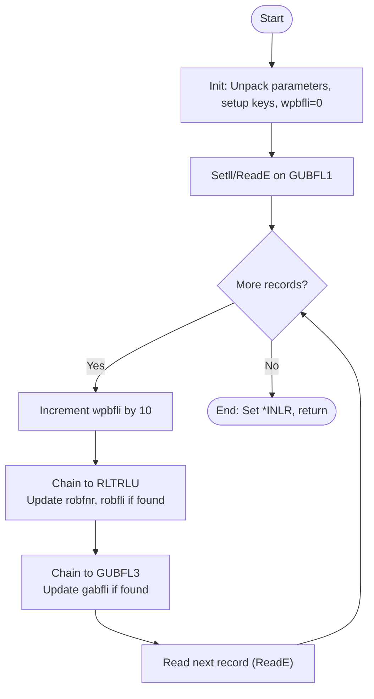

# Explanation of RPG Source Code: GL101R

## Purpose

This program, **GL101R**, is an ILE RPG application for the IBM i (previously AS/400) platform. Its function is to **renumber line numbers** on a payment proposal and update both the proposal number and proposal line number on a related transaction file.

---

## High-Level Overview

1. **Initialization**
   - Unpacks parameters from the parameter list and prepares working variables and keys.

2. **Main Processing Loop**
   - Iterates through payment proposals for a given company and proposal number.
   - Sequentially assigns new line numbers, incrementing by 10 for each record.
   - Synchronizes these changes to related records in both the transaction file and the proposal file.

3. **Program Termination**
   - Sets the Last Record indicator, ending the program.

---

## Key Components

### File Declarations

```rpg
fgubfl1    if   e           k disk    rename(gabfpfr:gabfpf1)
fgubfl3    uf   e           k disk    rename(gabfpfr:gabfpf3)
frltrlu    uf   e           k disk    rename(rltrpfr:rltrlur)
```
- **fgubfl1**: Input file, keyed access, renamed to `gabfpf1`.
- **fgubfl3**: Update file, keyed access, renamed to `gabfpf3`.
- **frltrlu**: Update file, keyed access, renamed to `rltrlur`.
- All files are based on physical files, likely representing proposals and transactions.

---

### Data Structures & Working Fields

```rpg
d                 ds
d dslist                         6
d  wpfirm                        3  0 overlay(dslist)
d  wpbfnr                        3  0 overlay(dslist:4)
...
d wpbfli          s                   like(gabfli)
d wplist          s              6
```
- `dslist`: A 6-position data structure overlayed by two 3-digit numeric fields (`wpfirm`, `wpbfnr`), representing company and proposal number.
- `wpbfli`: Working field for the proposal line number.

---

### Main Logic Flow

#### 1. Initialization Subroutine (`*inzsr`)
- Receives parameter list (`wplist`), unpacks it into `wpfirm` and `wpbfnr`.
- Initializes `wpbfli` (line number) to zero.
- Defines multiple key lists for various files. These define the set of fields used to access the correct records in each file.

#### 2. Main Processing Loop

```rpg
c     gubfl1_key    setll     gubfl1
c     gubfl1_key    reade     gubfl1                                 60
c                   dow       *in60 = *off
   c                   eval      wpbfli = wpbfli + 10
   ...
   c     rltrlu_key    chain     rltrlu
   c                   if        %found
   c                   eval      robfnr = wpbfnr
   c                   eval      robfli = wpbfli
   c                   update    rltrlur
   c                   endif
   ...
   c     gubfl3_key    chain     gubfl3
   c                   if        %found
   c                   eval      gabfli = wpbfli
   c                   update    gabfpf3
   c                   endif
   ...
c     gubfl1_key    reade     gubfl1                                 60
c                   enddo
```
- Uses the key (`gubfl1_key`) to position at the first relevant record in `gubfl1` (payment proposal file).
- Loops through all relevant records while indicator 60 (*in60) is off (meaning more records).
- In each iteration:
    - Increments the working proposal line number (`wpbfli`) by 10.
    - Chains (does a keyed fetch) to the transaction file (`rltrlu`) using a composite key.
        - If found, updates the proposal number and line number fields.
    - Chains to the payment proposal details file (`gubfl3`), and if found, updates the line number.
    - Reads the next relevant record.
- Ends when all records have been processed.

#### 3. Program End

```rpg
c     xslutt        tag
c                   eval      *inlr = *on
c                   return
```
- Sets the Last Record indicator on (ends program), then returns.

---

## Additional Notes

- **Indicator Usage**: Comments at the top explain how numbered indicators (*inXX) are used for various statuses (e.g., 60 for file not found, 16 for end of read loop, 31-59 for warnings/errors).
- **Keys**: Key lists (`klist`) are used to build composite keys for chained and random access to the database files.
- **Subroutines**: There is an empty subroutine `xlinje`—possibly placeholder for future extension or logic split.

---

## In Summary

- **GL101R** renumbers line items for payment proposals, and keeps associated transaction files in sync.
- For each relevant proposal, it assigns line numbers (10, 20, 30, ...) and updates two files to reflect the new line number and proposal number.
- It is designed for batch processing and assumes exclusive use of the target files for safe renumbering and updating.
- All business rules around indicator usage and file access are documented for maintainability.

---

## Diagram: High-Level Flow



---

This code is a representative example of typical database processing in legacy business systems on IBM i, with attention to data integrity and batch workflow efficiency.