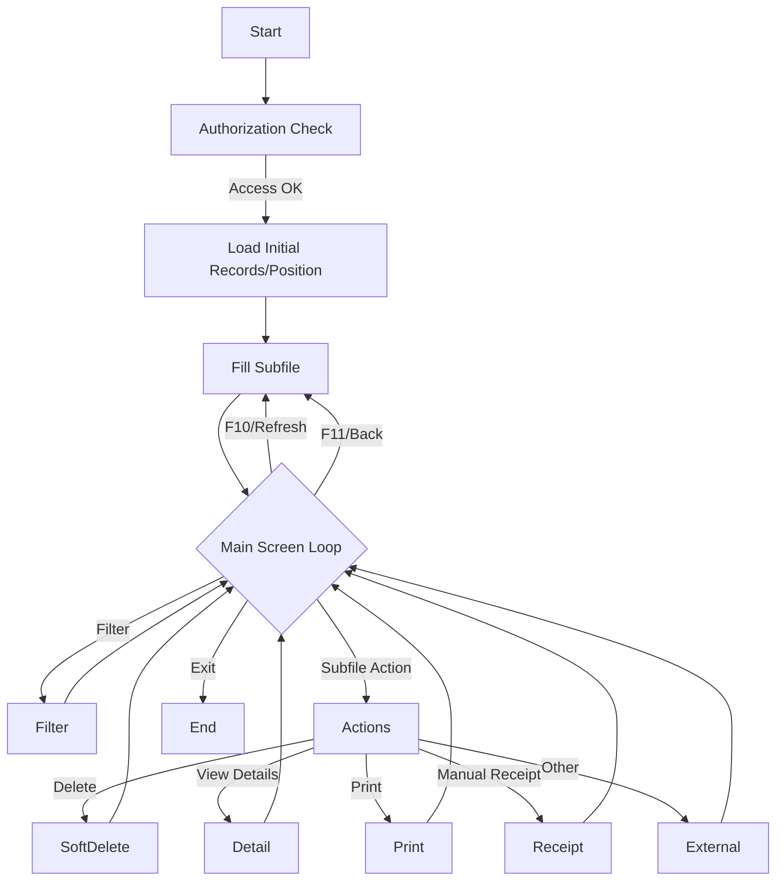

# RPG Program LI200R - Explanation

This document explains the IBM ILE RPG program `LI200R`. It's intended as an onboarding resource for developers working with this codebase.

---

## Overview

This program processes incoming EDI packing lists (pakksedler) as part of the logistics/inventory workflow. It reads, displays, filters, validates, processes, and updates EDI packing lists and related records via subfiles and several database tables.

- **System:** ASLAGR
- **Program:** LI200R
- **Description:** Behandling av innkomne EDI-pakksedler (Processing of incoming EDI packing lists)

---

## High-Level Flow

1. **Startup:** Program checks for valid user access/rights.

2. **Database Positioning:** Positions on the correct records in the main file.

3. **Subfile Handling:** Populates a subfile (workstation file) with EDI packing list records for display/select action.

4. **User Interactions:** Handles display, function key processing, menu actions, filtering, and selection of records.

5. **Transactional Actions:** Includes deleting, viewing details, printing, accepting, and further processing EDI records.

---

## Key Sections Breakdown

### 1. Indicators

Many indicators are defined and commented for screen and file status, error handling, protecting fields, etc.

### 2. File Declarations

Numerous physical and logical file declarations (`F-specs`) are made, often with `RENAME` to program-specific record formats. These represent tables such as:
- EDI packing list headers (e.g., `lphost`)
- EDI packing list items/lines (e.g., `lpkost`, `lpklst`)
- Parties (`lppast`)
- Logs
- Reference tables (like `rlevpfr` and warehouse/job tables)

### 3. Data Structures/Variables

- **Arrays:** For order numbers and suffixes (max 20).
- **LDA Fields:** Used to retrieve user, firm, and other session-unique values.
- **Feedback Data Structures:** For display file feedback (row/col positions, function key pressed, etc).
- **Multiple Work Variables:** For keys, record fields, subfile management (w_srrn, w_spge, etc).

### 4. Entry & Initialization

- **Authorization:** Calls `AX700R` to check user access to this program.
- **Retrieves firm number** from LDA.
- **Initializes keys** and important subfile variables.

### 5. Main Program Loop

Handles display and processing of the main screen & subfile:
- **Display main menu:** Using the subfile and control format.
- **Function Key Handling:** Many keys (F9, F10, F11, etc.) mapped to specific subroutines.
- **Subfile Processing:** Handles reading cell actions and processing action codes (e.g., delete, view, print, manual receipt, etc).

### 6. Subroutines

The code is heavily structured with subroutines (`BEGSR`/`ENDSR`) for logical grouping and reuse:

#### Subfile Handling
- **Forny:** Refreshes (reloads) the subfile content.
- **clr_subfile:** Clears (empties) the subfile.
- **crt_subfile:** (Re)creates and populates the subfile, respecting filters and paginations.
- **bck_subfile:** Navigate back one page in the subfile.

#### Actions on Subfile Entries
- **xb4bld:** Delete packing slip and related dependent records ("soft" delete by updating status).
- **xb5bld:** Display message details.
- **xb6bld:** Print copy of packing slip and logs this action.
- **xb7bld:** Show packing slip SSCC/colli (carton/handling unit).
- **xb8bld:** Show order lines associated.
- **xb9bld:** Show orders on the packing slip.
- **xb10bld:** Trigger manual goods receipt with validation for scanning state and other restrictions.

#### Filtering/Searching
- **xh1win:** Handles filter entry windows for search criteria (supplier num, name, date, warehouse, etc.), validating input and setting up for subsequent queries.
- **sjekk_lnav:** Helper to check if entered supplier name matches actual name (soundex-style substring search, case-insensitive).

#### Others
- **xb9win:** Accepts approved packing slips from external program.
- **xb10win:** Transition to purchasing system.
- **xb11win:** Transition to carton scanning.
- **xb13win:** Display status codes window.
- **hent_meld:** Trigger fetching new messages/jobs and handles error/lock states.

---

## Filtering Logic

Filters enable searching within the subfile on key fields (supplier number, name, packing slip ID/date, warehouse, etc.), supporting both direct matches and substring searches (like supplier names).

If filter criteria are entered, `crt_subfile` will skip records that do not match, using helper subroutines as necessary, especially for more complex logic (e.g., matching warehouse/lager across multiple fields).

---

## Record Deletion/Processing

- **Soft Deletes:** Instead of removing records, status fields (`phstat`, etc.) set to '99' to indicate deletion. This is applied recursively to all related child records (packing lines, order lines, parties, etc.).
- **Manual Goods Receipt:** Controlled, with checks preventing processing for records already being handled/scanned elsewhere, or if other business criteria are not met.

---

## File and Subfile Usage

- **Subfiles:** Used for paginated list display, with page up/down, search, and select actions.
- **DSPOPN/DSPLY:** All display actions routed through the main subfile and control format.

---

## External Calls

The program relies heavily on external programs for:
- Authorization (`AX700R`)
- Printing (`LI610C`)
- Receiving goods (`LI300R`)
- Fetching new messages (`FA730R`, `FA720R`)
- Various dialogs, logging, and lookups

---

## Constants and Localization

- **Localization:** The program comments and some constant strings are in Norwegian.
- **Case Conversion:** Uses character-translate (`%xlate`) tables for case-insensitive search/filter.

---

## Key Points for Onboarding Developers

- **Understand Subfile Handling:** RPG subfiles are the main driver for list display and navigation.
- **Indicator Usage:** Many logic branches are based on indicator states (screen, error, mode, etc.).
- **Business Rules:** Several checks around deletion, approval, and manual receipt come from process/business logic.
- **External Programs:** This program is a hub calling several other RPG programs for specific operations.
- **File Organization:** Frequent use of RENAME on physical/logical files to simplify record field referencing.
- **Filtering:** Extensive and flexible filtering logic. Pay attention to substring matching, case handling, and multi-field filters (especially for warehouse).
- **Soft Deletion Logic:** No records are physically removed—status is updated for all affected child records as well.
- **Error Handling:** User errors (invalid input, business rule violations) are reported via popups/dialogs and error indicators.

---

## Useful Reference Table Names

| Physical/Logical File | Use                          |
|---------------------- |-----------------------------|
| lphost                | EDI packing slip headers     |
| lpkost                | EDI packing slip colli       |
| lpklst                | EDI colli lines              |
| lppast                | EDI packing slip parties     |
| lbhost                | Order header per colli       |
| lblist                | Order lines per colli        |
| lohepfr               | Orders main (header)         |
| elogpfr               | Logging table                |
| rlevpfr               | Reference for suppliers      |
| ausrpfr/ra10pfr       | Users and warehouse refs     |

---

## Program Structure Diagram

---

## Further Reading

- **IBM RPG Subfile Programming:** For more on how subfiles and indicators work.
- **RPG IV Language Reference:** For syntax details, especially on modern built-in functions and data structures.
- **Business Process Documentation:** For process rules about EDI, goods receipt, and warehouse handling.

---

**In summary:**  
LI200R provides a robust RPG-based interface for handling, filtering, and processing incoming EDI packing slips, supporting key logistics processes, and enforcing business rules across a network of related tables and programs.